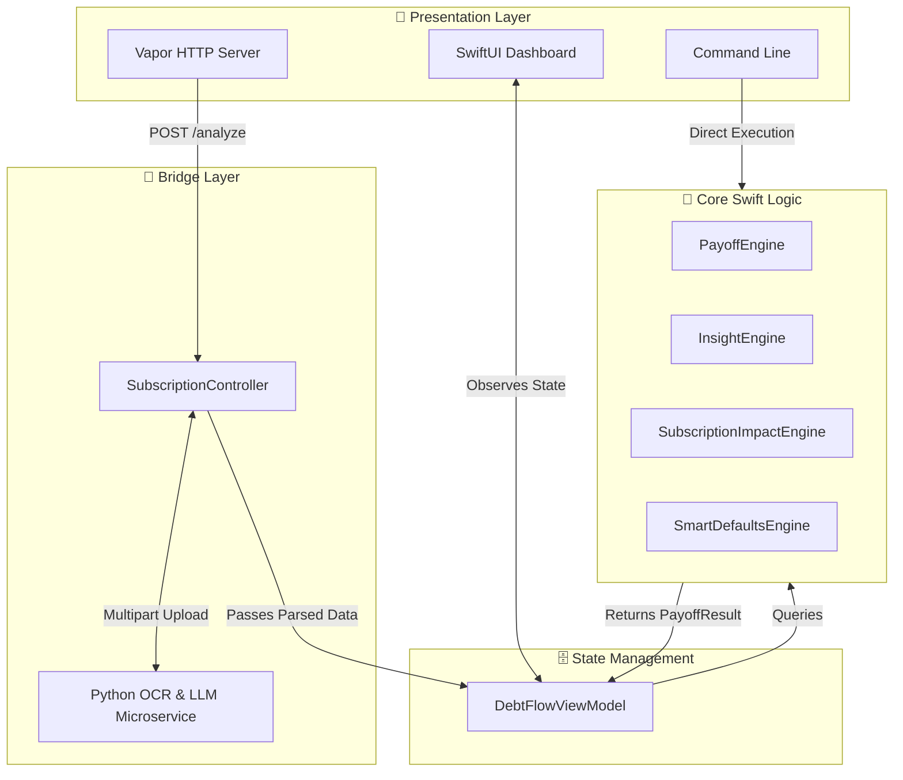

# 🌊 DebtFlow

> "Turn debt into decisions. Turn numbers into life."

DebtFlow is a native iOS application and high-performance financial awareness engine. Far beyond a traditional calculator, it analyzes your financial landscape, minimizes manual input using smart defaults, and translates raw debt data into real-life impact—showing you not just how much you owe, but how your financial choices affect your time, freedom, and emotional well-being.

<div align="center">

| Dashboard View | Analysis View |
| :-: | :-: |
|  |  |

</div>


---

## 📑 Table of Contents

1. [The Market Problem](#-the-market-problem)
2. [The DebtFlow Solution](#-the-debtflow-solution)
3. [Core Features](#-core-features)
4. [Tech Stack](#-tech-stack)
5. [Architecture](#-architecture)
6. [Project Structure](#-project-structure)
7. [Getting Started](#-getting-started)
8. [Configuration & API](#-configuration--api)
9. [Security & Privacy](#-security--privacy)
10. [What’s Next](#-whats-next)
11. [Author](#-author)

---

## 📉 The Market Problem

The personal finance App Store category is highly saturated, yet fundamentally broken. The market is divided into two extremes:
1. **High-Friction Tools**: Apps that demand spreadsheet-level dedication, requiring manual entry for every transaction and interest rate.
2. **Predatory "Free" Apps**: Platforms that offer simple calculators, but exist solely to harvest financial data and cross-sell high-interest refinancing loans.

Simultaneously, the modern "subscription economy" has normalized hidden, recurring costs. Users are bleeding money passively, making the climb out of debt steeper and more obscured. Existing tools treat debt as sterile math; they fail to address the behavioral psychology required to actually become debt-free.

---

## 💡 The DebtFlow Solution

DebtFlow is built to reverse this trend. It is designed around **low friction, high insight, and absolute privacy**. 

Instead of showing users an intimidating amortization table, DebtFlow translates debt into its true cost: *time*. By leveraging local OCR and intelligent microservices, it actively hunts down passive subscription drains and mathematically proves how many months of freedom those subscriptions are costing the user. 

It replaces the spreadsheet with empathetic, behavioral-driven intelligence.

---

## ✨ Core Features

- **Native SwiftUI Experience**: A fluid, responsive iOS interface driven by a highly decoupled `DebtFlowViewModel` and engine.
- **Dynamic Debt Payoff Strategies**: Optimize the path to freedom using mathematically sound strategies.
  - *Avalanche*: Tackle high-interest debts first for maximum long-term savings.
  - *Snowball*: Build psychological momentum by clearing small balances quickly.
  - *Momentum*: A proprietary hybrid for quick wins followed by long-term optimization.
- **Smart Defaults Engine**: DebtFlow intelligently infers necessary variables, preventing the app from blocking progress when users don't know their exact APR or minimum payments.
- **Subscription Impact Analysis**: Uses advanced OCR and a multi-persona AI (Conservative, Growth, Balanced) to detect subscriptions from screenshots, quantifying exactly how they delay financial freedom.
- **Insight Engine**: Transforms cold calculations into empathetic, life-impact messaging. Understand debt in terms of "time reclaimed" and "future freedom."

---

## 🛠 Tech Stack

Built for performance, modularity, and strictly native execution.

- **Swift 5.9**: High-performance core logic capable of running on Windows, macOS, and iOS.
- **SwiftUI**: Modern, declarative UI framework powering the iOS application.
- **Foundation & WinSDK**: Robust data handling and socket networking.
- **Python/Ollama Microservice**: A lightweight, containerizable Python service handling EasyOCR and local LLM (Llama 3.1) processing to keep the Swift codebase pure and performant.

---

## 🏗 Architecture

DebtFlow was engineered with a strict adherence to protocol-oriented programming. The UI and the math never mix.



- **`PayoffEngine`**: The core mathematical brain crunching 50-year forward-looking amortization schedules and strategy optimizations.
- **`InsightEngine`**: The contextual layer that translates raw financial output into human-readable emotional nudges.
- **`SubscriptionImpactEngine`**: Evaluates ongoing passive expenses and computes their compounding effect on the payoff timeline.
- **Modular Interfaces**: The exact same Swift engine powers the native SwiftUI views (`DebtLiquidationFlowView`), the interactive CLI, and the HTTP API endpoints (`SubscriptionController`).

---

## 📂 Project Structure & Architecture

DebtFlow follows a strict separation of concerns, ensuring that mathematical logic, API routing, and SwiftUI presentation remain entirely decoupled.

```text
Sources/DebtFlow/
├── Engine/                            # Core domain logic. Pure Swift, zero UI dependencies.
│   ├── PayoffEngine.swift             # Computes 50-year amortization schedules (Avalanche/Snowball)
│   ├── InsightEngine.swift            # Translates metrics into empathetic, behavioral nudges
│   ├── SmartDefaultsEngine.swift      # Friction-killer: safely infers missing user inputs
│   └── SubscriptionImpactEngine.swift # Mathematically proves how much time subscriptions steal
│
├── Interfaces/                        # Presentation layer: SwiftUI + Standalone HTTP Server
│   ├── DebtFlowApp.swift              # @main entry point for the native iOS/macOS SwiftUI app
│   ├── MainFlowView.swift             # Master navigation stack & Enterprise Security (FaceID/Blur)
│   ├── DebtLiquidationFlowView.swift  # Master dashboard rendering the financial timeline
│   ├── InputScreen.swift              # SwiftUI view for elegantly capturing debt data
│   ├── ResultScreen.swift             # SwiftUI view displaying payoff timelines and milestones
│   ├── AppTheme.swift                 # Centralized design system (colors, gradients, typography)
│   ├── HTTPServer.swift               # Lightweight HTTP server for API mode
│   └── ServerLauncher.swift           # Bootstraps and configures the standalone server
│
├── Models/                            # State management and data structures
│   ├── DebtFlowViewModel.swift        # @Observable state manager connecting Engine to SwiftUI
│   ├── Debt.swift                     # Core Codable data structure for financial obligations
│   ├── AIAnalysis.swift               # Structures for external LLM 3-persona insights
│   └── MockData.swift                 # Comprehensive preview data for SwiftUI Canvas rendering
│
├── Controllers/                       # Bridge to external services
│   └── SubscriptionController.swift   # API router handling uploads & Python LLM communication
│
└── Utils/                             # Shared helpers and extensions
    ├── MoneyUtils.swift               # Thread-safe currency formatters and decimal rounding
    └── DateUtils.swift                # Translates raw month counts into human-readable time
```

---

## 🚀 Getting Started

DebtFlow is versatile. Run it as an API, a CLI, or build the iOS app.

### 1. Build the Project
```bash
swift build
```

### 2. Run the SwiftUI App (macOS/iOS)
Open the `Package.swift` or `.xcodeproj` in Xcode and select the DebtFlow target to run the native application.

### 3. Run Server Mode (API)
Start the lightweight HTTP server to feed data or act as a backend.
```bash
swift run DebtFlow
```

---

## ⚙️ Configuration & API

When interacting via the API, DebtFlow accepts structured JSON payloads.

**Sample Request (Evaluate Payoff Strategy):**
```json
{
  "debts": [
    {
      "name": "Credit Card",
      "balance": 5000,
      "annualInterestRate": 22.9,
      "minimumPayment": 150
    }
  ],
  "extraMonthlyPayment": 300,
  "strategy": "momentum"
}
```

---

## 🔒 Enterprise-Grade Security & Privacy

Privacy is a product feature, not an afterthought. DebtFlow integrates natively with iOS security frameworks to protect your financial data.
- **Biometric Lock**: The app integrates `LocalAuthentication` to require FaceID or TouchID before revealing any financial dashboards.
- **App Switcher Privacy Blur**: Financial data is automatically blurred when the app enters the background or the iOS App Switcher to prevent shoulder surfing.
- **Incognito Mode (Zero Persistence)**: DebtFlow stores absolutely no sensitive data by default. All calculations are run in-memory and wiped clean the moment the app closes.
- **Zero Analytics**: No third-party tracking SDKs are used. Logging is handled entirely locally via Apple's `OSLog`.
- **Input Validation**: Strict schema validation guarantees safe data parsing.

---

## 🔮 Future Scope (What’s Next)

- **Phase 2: Secure Enclave Persistence**: Adding a `KeychainManager` to allow users to securely save their debt profiles encrypted at rest, rather than relying solely on zero persistence.
- **Phase 3: CoreML & Vision Migration**: Porting the Python OCR microservice to Apple's native `Vision` framework, and integrating a quantized LLM via `MLX-Swift` to achieve 100% offline, on-device AI inference.
- **Open Banking Integration**: Adding secure, read-only Plaid/Tink integrations for users who prefer automated data fetching over manual entry.

---

## 👩‍💻 Author

**Aiyana Sehgal**  
*App Developer*

[](https://github.com/AiyanaSehgal)
[](https://linkedin.com/in/AiyanaSehgal)
